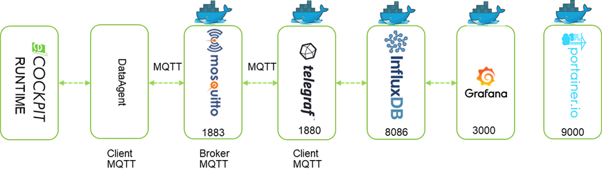
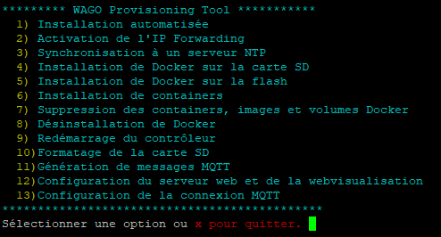

# WAGO Provisionning Tool

## Description
Ce dépôt contient tout le nécessaire pour installer l'ensemble de containers suivant l'architecture suivante : 
<div style="text-align: center">

</div>

Des variables sont postées en MQTT via la bibliothèque e!COCKPIT WagoAppCloud. Le broker MQTT (Mosquitto) est hébergé sur le contrôleur. \
L'applicatif Telegraf est abonné au topic MQTT sur ce broker, et poste les données dans une base InfluxDB dans un container dédié. \
Enfin les données sont affichées via l'outil de visualisation Grafana.  \
Le client MQTT peut aussi bien être interne que distant.  \
L'outil de gestion de containers Portainer est également installé pour faciliter la maintenance des containers.

Le script dispose d'une interface graphique qui permet d'installer indépendamment différentes actions. \
En sélectionnant la première option, le script automatise l'installation de Docker sur la carte SD, le téléchargement des imagesD ocker, fichiers de configuration et package nécessaires et leurs installations.

Ce projet est en beta - son utilisation relève de votre responsabilité. 

## Prérequis

Ce script fonctionne sur les plateformes suivantes : 
- PFC200 G2
- Touch Panels 600
- Edge Controller
- Compact Controller 100

Le contrôleur doit être démarré depuis la flash interne, pas depuis une image bootable sur la carte SD.
Une carte SD (/media/sd) doit être insérée et préalablement formatée en ext4 via le WBM (Docker sera installé sur la carte SD).

Le PFC, Edge Controller ou TP600 doit disposer d'un accès à Internet (penser à renseigner DNS et Gateway).

La date et heure du contrôleur doivent être mises à jour pour éviter des erreurs lors de l'échange TLS. 
Dans le WBM, mettre à jour l'heure dans <em>Configuration / Clock</em> ou spécifier un serveur de temps dans <em>Ports and service / NTP Client</em>
En sélectionnant la synchronisation à un serveur de temps ou l'installation automatisée, le serveur time.google.com sera automatiquement ajouté.

## Installation
Se connecter en SSH au contrôleur via PuTTy par exemple, en tant que super utilisateur (<em>root / wago</em> par défaut, penser à le modifier).

Exécuter la commande suivante qui permet le téléchargement de ce script, lui donne les droits d'exécution et l'exécute.

```
wget https://raw.githubusercontent.com/quenorha/wpt/main/install.sh -O $PWD/install.sh && chmod +x $PWD/install.sh && $PWD/install.sh
```

Le menu interactif ci-dessous doit apparaître :
<div style="text-align: center">

</div>

## Evolution
Le MQTT doit être sécurisé en mettant en place les certificats TLS. 

## Crédits
L'interface sous forme de menu est basée sur le [WAGO Provisioning Tool](https://github.com/braunku/pfc-provisioning-tool) de Kurt Braun (braunku) 
